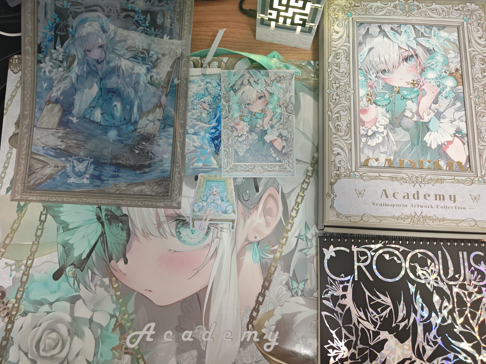
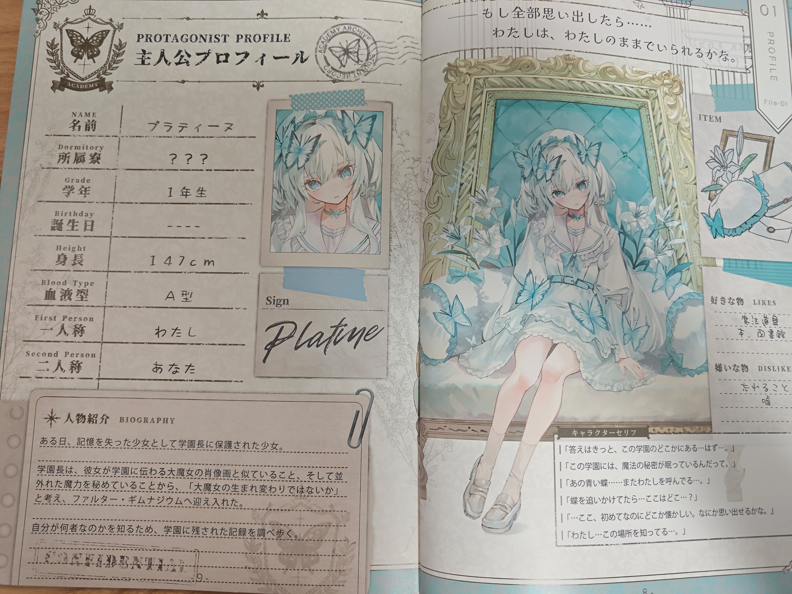
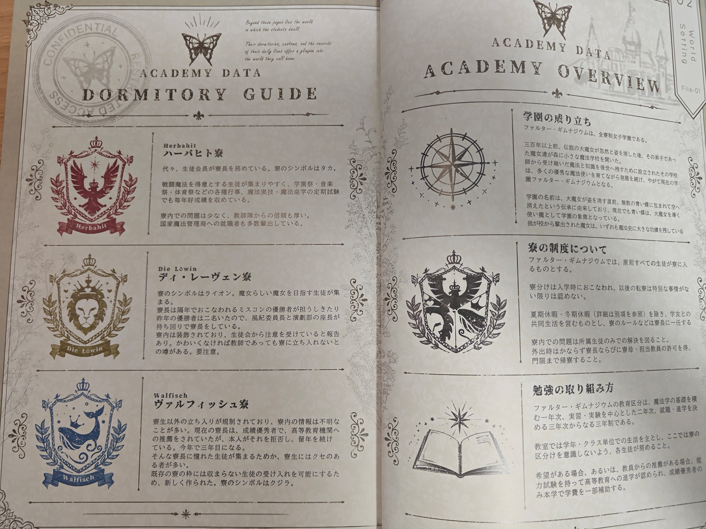
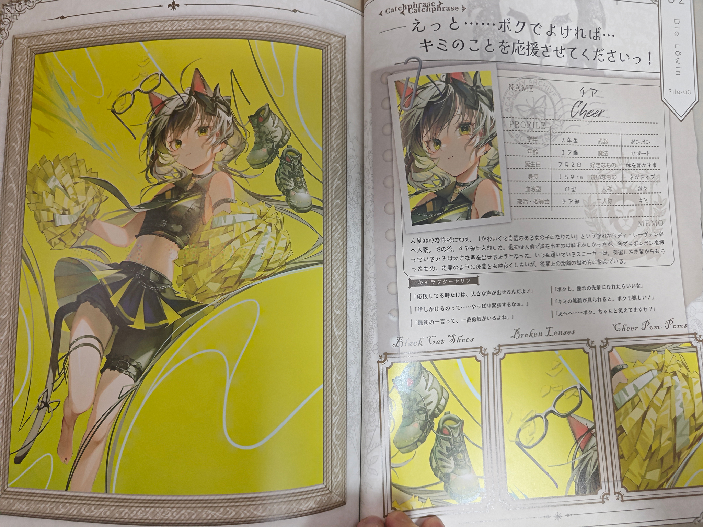
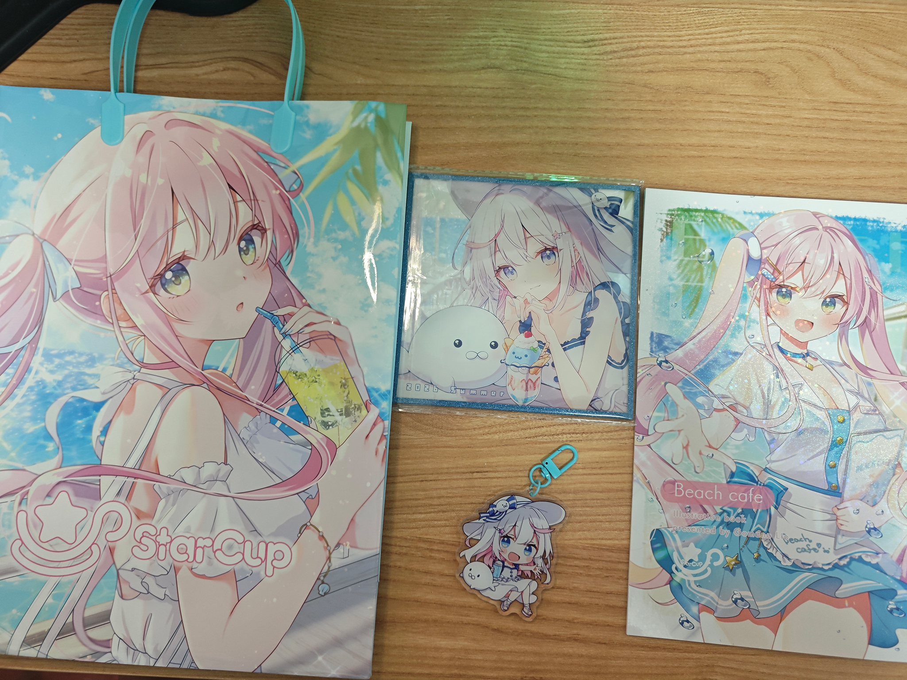
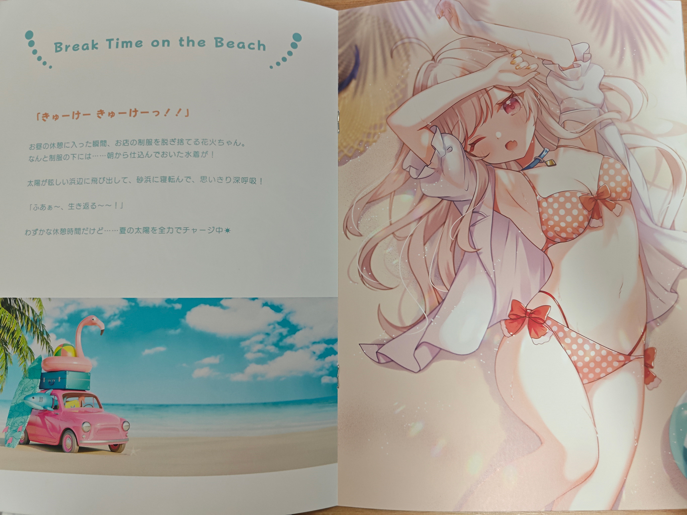
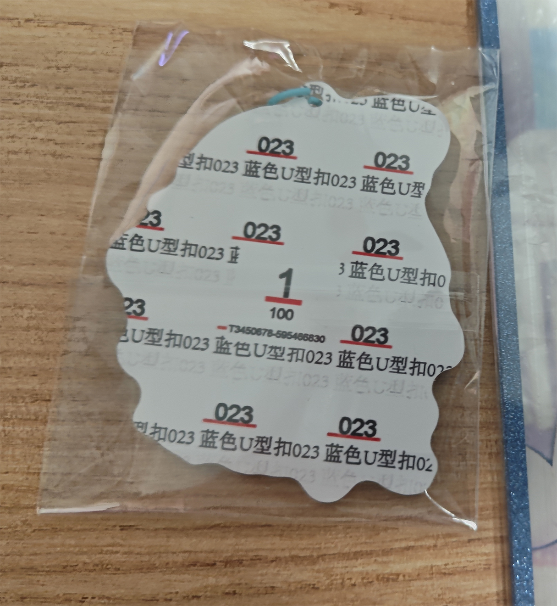

[C108](https://mzh.moegirl.org.cn/Comic_Market?useskin=vector-2022)于8.15、8.16两天举办~~正好是二战日本投降日~~，这次托[和久井まゆ](https://splendidnova.github.io/)帮我带了两套set，除了画册之外还有周边，非常感谢。

前两次 CM 都买了アシマ老师（就是这个博客背景图的画师）的画册，但这次没有出摊；こやーふ老师有出摊，但考虑到很多画师在相邻展会之间发行的画集内容会有重合，还是准备下次再买。

这次买了两位画师的画册，她们之前的作品我都没有买过，而正好她们近期的画作都是我喜欢的类型，运气非常好。

## 开箱视频

:::bilibili BV1nm8b6ZE3w

## ねぎまぷりん

画师推特：[negimapurinn](https://x.com/negimapurinn)

第一位决定要买的就是ねぎまぷりん老师的作品。ねぎまぷりん的画作极有个人风格，画风辨识度相当的高。有一段时间她的画作风格较为狂气、色彩复杂且鲜艳，不属于我喜欢的类型。而她近期的作品以蓝白色调为主、整个线条给人一种柔和感，好看到爆。

这次她文件夹（图片左上）背面这张图是我最喜欢的一张，构图创意十足、笔触相当精致。这张图也有发 pixiv（[144342056](https://www.pixiv.net/artworks/144342056)），可以仔细品鉴。

所以这次买了一套3000日元的set，包括画册、文件夹、色纸、书签、手机贴、笔记本、盒子、纸袋。

不得不提一下这个纸袋，足足 55×40cm 恁大一个，凭一己之力把运费拉高一截。~~而且现在的问题就来到了我要怎么收纳这个大袋子。~~

画册内容还挺多的，主要是ねぎまぷりん的OC相关，即一个短篇小说及其关联的角色、背景等。内容上大概是失忆的女主疑似三百年前的大魔女转世，因此被大魔女所创学院的院长收留；来到图书馆后确认了大魔女画像里的就是自己，找回了记忆，想起自己是为了和某人想见而穿越时光来到现在。

里面还有一些关于故事背景的介绍，包括学校起源、宿舍、学习体系之类的

还有很多之前画的 OC 也是这里的角色。大致看过去应该大多在X或者pixiv上发过，比如下面这张[142878092](https://www.pixiv.net/artworks/142878092)就是之前在她个人展上的。

后面就是一些绘制过程、插画细节讲解之类的，相当丰富，整本画集有7mm厚。

## 胡麻乃りお

画师推特：[gomalio_y](https://x.com/gomalio_y)

这次是日常刷推的时候看到胡麻乃老师的新插画，也就是纸袋子上的这张，非常好看。她的画风也一直是属于我喜欢的类型，色彩鲜艳程度和线条柔和度都适中，~~看板娘也是冲国人最喜欢的白毛~~。

<!-- <blockquote class="twitter-tweet"></blockquote> -->

而且这次她的周边里有一个钥匙扣，非常可爱，而我正好缺一个钥匙扣，完美，买！

胡麻乃老师本次的画册相对而言比较薄，其他谷子就是亚克力色纸、钥匙扣、纸袋子，整套 set 的价格是2000日元。

画册内容是左侧介绍、右侧图片的形式，主题是夏日海滩咖啡馆，两个 OC 的角色分别是咖啡店看板娘和常客，文案和人设都非常可爱。

关于钥匙扣，昨天有群友问我钥匙扣是单面还是双面的，单面的实用性差就不打算买。当时我还没拿到，所以就去问和久井まゆ帮我看一眼。钥匙扣背面印着神秘の东方义乌文字，误以为是单面的，直接导致群友战略误判。~~都是老钟害的，诶哟老钟怎么这么坏啊乆乆乆~~

## 结语

总之这次就是买了两位画师的set，总体而言非常满意。

不出意外的话，今年10月底的秋 M3 会买几张专辑，到时候再视情况写一篇博客罢。
